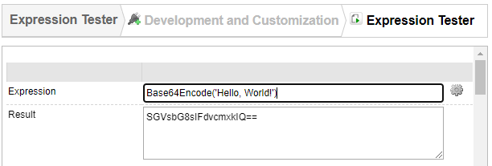

# Base64
Base64 is a simple plugin providing two new Value Patterns (functions):
- Base64Decode
- Base64Encode

# Usage
## Encode
`Base64Encode('Hello, World!')` will return **SGVsbG8sIFdvcmxkIQ==**.

## Decode
`Base64Decode('SGVsbG8sIFdvcmxkIQ==')` will return **Hello, World!**.
