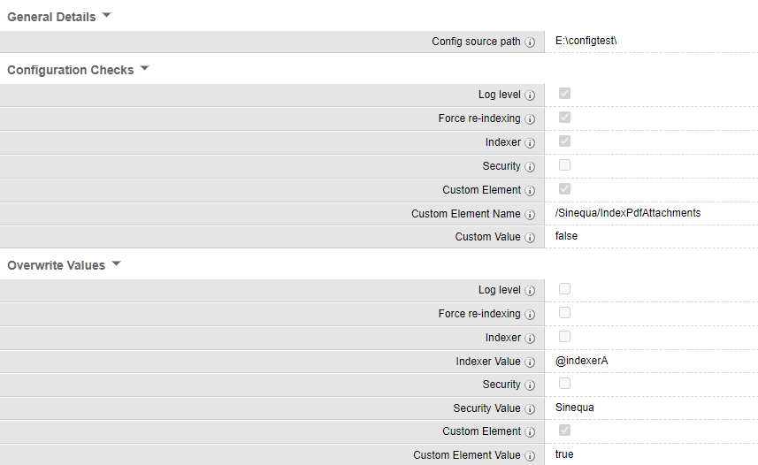

# ConfigChecker

Many times configuration files need to be pushed from development environment to higher environments(like staging or production).
There are some good practices to be followed for configuration files when pushed to production, like force re-indexation should be off, loglevel should be set to default indexer should be set to alias etc.

ConfigChecker command helps to check sinequa configuration files to validate these element values.

- **Please make sure not to run the command directly in the main sinequa configuration folder. Create a seperate folder only with required configuration files.**

**Example folder structure:**

- config_stage/sources/collection1/default.xml
- config_stage/sources/collection2/default.xml
- config_stage/jobs/job1.xml

## Settings

### Command Settings

| Group                | Field                | Type    | Comments                                                                                                                      |
| -------------------- | -------------------- | ------- | ----------------------------------------------------------------------------------------------------------------------------- |
| General settings     | Config source path   | String  | Path of the configuration files to be checked. Make sure to choose a path only with select config files                       |
| Configuration Checks | Log Level            | Boolean | Checks whether log level exists.                                                                                              |
| Configuration Checks | Force re-indexing    | Boolean | Check whether force reindexation is active.                                                                                   |
| Configuration Checks | Indexer              | Boolean | Check whether indexer value is an alias.                                                                                      |
| Configuration Checks | Security             | Boolean | Check whether collections have security level.                                                                                |
| Configuration Checks | Custom Element       | Boolean | Check for custom element within XML.                                                                                          |
| Configuration Checks | Custom Element Name  | String  | Name of the custom element name from the XML. This is the xpath name from the required XML file.                              |
| Configuration Checks | Custom Value         | String  | Custom element value to be compared.                                                                                          |
| Overwrite Values     | Log Level            | Boolean | Overwrites the log level to default                                                                                           |
| Overwrite Values     | Force re-indexing    | Boolean | Overwrites force re-indexing to false.                                                                                        |
| Overwrite Values     | Indexer              | Boolean | Overwrites indexer value to the required value from the textbox.                                                              |
| Overwrite Values     | Indexer Value        | String  | Required indexer value to be overwritten. Valid only if Indexer overwrite is set to true. Example @@AllIndexers or @IndexerA. |
| Overwrite Values     | Security             | Boolean | Overwrites security value to the required value from the textbox.                                                             |
| Overwrite Values     | Security Value       | String  | Required domain security value to be overwritten. Valid only if security overwrite is set to true.                            |
| Overwrite Values     | Custom Element       | Boolean | Overwrites custom value to the required value from the textbox.                                                               |
| Overwrite Values     | Custom Element Value | String  | Required custom element value to be overwritten. Valid only if custom element overwrite is set to true.                       |

## Install

Deploy the form override, command and the plugin file in your config:

- form-overrides/command.ConfigChecker.xml
- plugins/ConfigChecker/ConfigChecker.cs
- plugins/ConfigChecker/plugin.xml
- commands/ConfigChecker.xml

## NOTE:

- The command already has some values added in the command configuration for reference. Please make sure to change the values as per your requirement.
