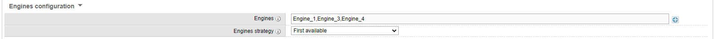
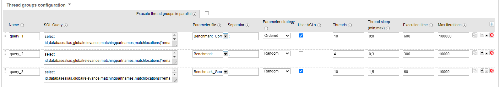
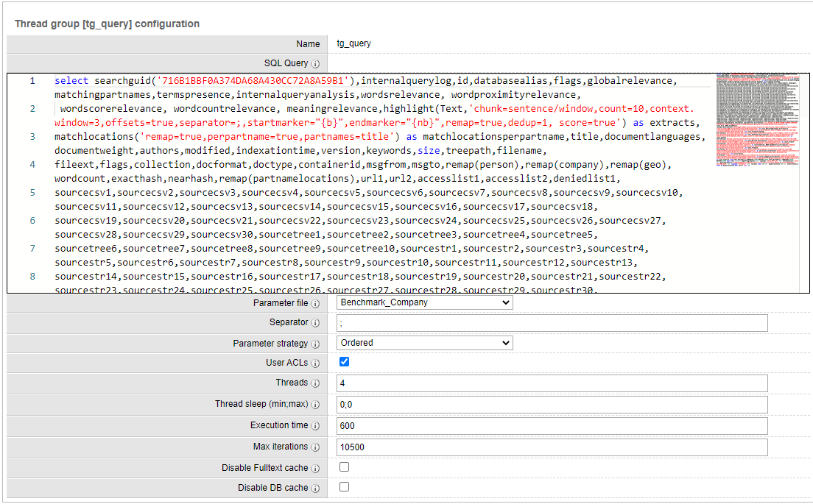
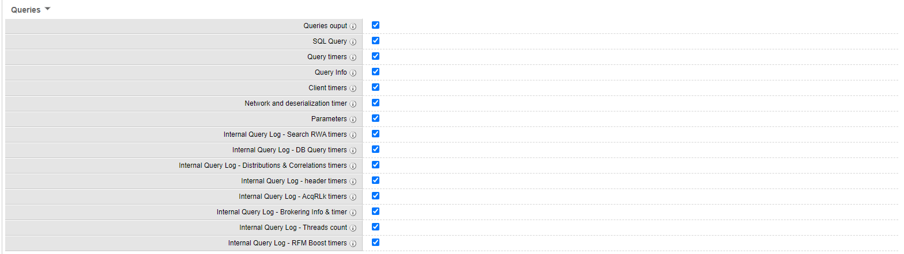
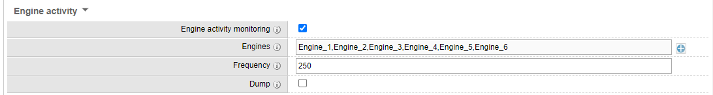

# EngineBenchmark

EngineBenchmark command aims to measure engine(s) performances at query time. Using this command, you can run repeatable and quantifiable scenarios to analyze what are the performances of the engine(s) through a set of metrics.

**This command allows you to measure engine(s) performances only**. This does not reflect what the user experience will be because some metrics are excluded such as: WebApp, network and browser rendering time.

In order to get accurate metrics, you need to **create realistic scenarios**. Your scenarios must closely reflect how the platform is or will be used. For example, even though the application will be accessible to thousands of users, only a small portion of them will use it in parallel  and only few will perform searches at the same time. So do not try to simulate thousands of concurrent queries if your Sinequa Grid has not been designed for it or if it's not the case. As a rule of thumb, it's **highly recommended to leverage the audit log** to get a sense of the activity on the platform and try to derive scenarios from it (using audit logs).

## Where should I execute the command ?

It is **recommended to execute this command on a different node than your Engine(s)**. The reason is, the command will use resources (CPU / memory) and this may affect Engine performances. If possible, you must run this command on a different Node, if not, make sure the command will have a minimum impact on performances (by reducing the number of threads for instance).

## Table of contents

* [Installation steps](#installation_steps)
* [Configuration](#configuration)
    * [General](#configuration_global)
        * [Simulate](#configuration_global_simulate)
        * [Engines](#configuration_global_engines)
        * [Thread Group](#configuration_global_threadgroup)
    * [Security](#configuration_security)
        * [Users ACLs](#configuration_security_acl)
    * [Output](#configuration_output)
        * [Output types](#configuration_output_types)
        * [Output environment information](#configuration_output_environment_info)
        * [Queries output](#configuration_output_queries)
        * [Cursor size breakdown](#configuration_output_cursor)
        * [Dump](#configuration_output_dump)
        * [Engine Activity](#configuration_output_engineactivity)
* [Logs](#logs)
    * [Log format](#logs_format)
    * [Log level](#logs_level)
    * [Indexes Statistics](#logs_stats_indexes)
    * [Queries Statistics](#logs_stats_queries)
    * [Engines Activity Statistics](#logs_stats_engines)


# <a name="installation_steps"></a> Installation steps

1. Copy the "*form-overrides*" folder to your *˂sinequa_data˃/form-overrides* folder
1. Copy the "*EngineBenchmark*" plugin folder to your *˂sinequa_data˃/plugins* folder
1. Add a new environment variable "*SystemXmlLinqDll*" that must point to the "*System.Xml.Linq.dll*". This DLL can be found in *C:/Windows/Microsoft.NET/Framework/˂.NetVersion˃/* folder where *˂.NetVersion˃* is the version of the .Net Framework.
1. Perform a "refresh configuration" in "global options"
1. Build the "EngineBenchmark" plugin.  Note: If the plugin fail to compile try the following:
    1. Make sure the plugin "Debug build" is disabled (advanced section of the plugin)
    1. Copy the "System.Xml.Linq.dll" into the "sinequa/website/bin" folder
    1. Build the plugin

# <a name="configuration"></a> Configuration

## <a name="configuration_global"></a> General

### <a name="configuration_global_simulate"></a> Simulate


Field | Type | Default value | Required | Comment
--- | --- | --- | --- | --- 
Simulate | Boolean | False | | Simulate execution, output only logs. Queries are **not** send to the engines. This mode will force the log level to 20. Ref: [Log level](#logs_level) 

### <a name="configuration_global_engines"></a> Engines



Field | Type | Default value | Required | Comment
--- | --- | --- | --- | --- 
Engines | List |  | yes | An Engine or a list of Engines, used to get the Engine Client to perform queries in the thread groups. If you select multiple Engines, the Engine used to perform the query will be dictated by the "Engine strategy" parameter.
Engines strategy | List | First Available | yes | First available: first available Engine from the list. If you select this option, all the queries will be executed on the same Engine. An engine is considered as "available" if his status is alive.<br> Random: load balance the queries between the Engines from the list.

**Recommendation**: Reproduce the "search strategy" defined in your "profile" or "Web Service - Search query". See below the mapping between the search strategy and how to configure the command:
* Strategy: "Normal", "Only EngineName", "Default engine of available"
    * Engines: Same engine as default or selected
    * Engines strategy: First Available
* Strategy: "Preferred ordered search engines of available"
    * Engines: Same engines as defined in the "search strategy", order matter
    * Engines strategy: First Available
* Strategy: "Preferred random search engines of available"
    * Engines: Same engines as defined in the "search strategy", order does not matter
    * Engines strategy: First Available
* Strategy: "Symmetric load balancing"
    * Engines: Same engines as defined in the "search strategy"
    * Engines strategy: Random

### <a name="configuration_global_threadgroup"></a> Thread Group



Field | Type | Default value | Required | Comment
--- | --- | --- | --- | --- 
Execute thread groups in parallel | Boolean | False |  | Thread groups will be executed in parallel. <br> **Note**: If checked, the number of threads executed in parallel will be the sum of "threads" defined in the "thread groups" grid.
Name | String |  | yes | Thread group name, used in logs and output file.
SQL Query | String |  | yes | Support only select statement. You can use variables in this field with the following syntax {myvar} where myvar is the variable name. These variables will be replaced by values from the "parameter file". The curly brackets must enclose your variable name. <br> **Example**: select * from myindex where text contains {SqlString(text)} and SearchParameters='mac={mac},pss={pss}' skip 0 count 20 <br> **Note**: You can use value patterns in the SQL statement. Consider to leverage it in order to escape the text contains value. See example: text contains {SqlString(text)}<br> **Note**: If your SQL statement use indexes located on different Engines (replicated indexes and/or brokering), you must reference the indexes as follow: indexname@EngineHost:Port&#124;EngineHost:Port&#124;...&#124;EngineHost:Port
Parameter file | List |  | yes | Custom file containing the variables names in the header (first line). Each subsequent line will represent a set of values. <br> **Example**: <br> text;mac;pss <br> sinequa;10000;1000000 <br> enterprise search;5000;2000000 <br> **Note**: The variable name must not be enclosed between curly brackets and lines must have the same number of values as defined in the header.
Separator | Char | ; | yes | Separator used in "Parameter file"
Parameter strategy | List |  | yes | Strategy to read values from "Parameter file". Values are pulled by line, the strategy define what line values is used to replace the variables in the SQL. <br> Ordered: threads will read lines from top to bottom. <br> Random: read in random order <br> **Note**: If you use more than 1 thread, with "Ordered" strategy, output order will look different because threads are running in parallel.
User ACLs | Boolean | false |  | If checked, add user ACLs in the SQL query. Will use the same strategy as defined for "Parameter strategy" (Ordered or Random). Please refer to the "Security Tab", "Users ACLs" section for more information. <br> **Note** If used, make sure you SQL query contains a where clause without ACLs.
Threads | Integer | 5 | yes | Number of parallel threads, each thread will execute a SQL query.
Thread sleep | String | 3;10 | yes | Define min and max boundaries in seconds before a thread execute SQL query. Values are in seconds. Syntax: min;max. <br> **NOTE**: Min & Max values are in seconds <br> **NOTE**: Sleep instruction happens after thread start but before SQL execution <br> **NOTE**: For no sleep duration, use 0;0
Execution time | Integer | 60 | yes | Maximum execution time in seconds. Once execution time is reached, stop all threads execution. -1 for infinite.
Max iterations | Integer |100 | yes | Maximum number of iteration (SQL queries executed). Once max iterations is reached, stop all threads execution. -1 for infinite.
Disable Fulltext cache | Boolean | false | yes | This option is available through the "advanced options" button. Disable indexes FullText cache by adding 'using cache 0' to the SQL query. When enabled, will force the Engine to read all data from disk and bypass Index cache. This will result in increasing 'FullTextSearchRWA' timers.
Disable DB cache | Boolean | false | yes | This option is available through the "advanced options" button. Disable indexes DataBase cache by adding 'csf=1' to the SQL query Searchparameters. When enabled, force the Engine to evaluate the Boolean query on columns for the where clause. . This will result in increasing 'ExecuteDBQuery' timers.

### <a name="configuration_global_threadgroup_advanced"></a> Thread Group Advanced Settings

You can access the "advanced settings" of a thread group by clicking on the pencil icon. This gives you access to more options that are less commonly used. 




**Recommendations**: 

As a rule of thumb, make sure the Engine(s) is/are warmed before you execute you benchmark. If needed, run the benchmark a first time to warm the Engine(s). Make sure you run you benchmark for long enough (either number of iterations or max duration) to get a good amount of metrics to analyze. For instance, performing a run that will run for 10 minutes with at least 10K queries performed is a good practice.

SQL Query: Use the SQL query generated by your "profile" or "web service - search query" as an input for the SQL query. If you have "Tabs" you can also simulate the tab query by adding a second thread group with the tab query. In that case, you should probably use the "Execute thread groups in parallel" option.

Parameter file: In order to get a realistic simulation, a good practice is to use "audit" usages. Especially if you have a "text contains" clause, you can populate your parameter file with the top N fulltext search from the "audit" index. Don't hesitate to create multiple "parameter file" for different scenarios/thread group.

User ACLs: Consider using this option rather than adding users ACLs into your parameter file.

Threads	& Thread sleep: Use realistic values for these two parameters, try to estimate what is the real number of concurrent users on the system at peak time and define a sleep range that represent time in between two searches. No one is performing a query every two seconds, users must look at the results, open documents before searching again.

**NOTE**: By default, thread groups are executed sequentially, if you check "Execute thread groups in parallel" all thread groups will be executed in parallel. Consider this setting if you want to simulate both Tabs and Search query.

How to make sure I will run the same scenario multiple times?

To do that, use the "Ordered" option for "Parameter strategy" and make sure you'll always execute the same number of queries. So the trigger to stop the execution must be "Max iterations" and not "Execution time".

**Disabling cache**

Indexes caches can be disabled using the two dedicated options of the thread group: "Disable Fulltext cache" and "Disable DB cache". However, keep in mind both the system and the hardware have their own cache mechanism. This means, there is always cached at play we can't control. Ultimately, running the same benchmark with Indexes cached disabled will no guarantee consistent results.


# <a name="configuration_security"></a> Security


## <a name="configuration_security_acl"></a> Users ACLs

Field | Type | Default value | Required | Comment
--- | --- | --- | --- | --- 
Security Syntax | List | Engine | yes | Legacy: Full security clause (identities and groups) are sent as part of the SQL query. <br> Engine: only user identity is sent as part of the SQL query. Please note, Engine security requires version >= 11.3.0
Security Domain | List | | yes | Security domain used to get users id or user name
User ID / Name | String | | yes | You can use both a user ID or a user name
Comment | String | | no | Comment

Adding users in "Users ACLs" will automatically add one of the user security clause in the where clause. Users ACLs will be added only if you check "user ACLs" to the given thread group.

**Recommendation**: It is highly recommended to use this feature. If you don't provide any security clause in the SQL will be equivalent to perform a query on all the documents from your indexes. Querying all the document will most likely degrade search performances and by extension provide biased results. Try to add users from different business units because this will give more accurate results: users will more likely have access to different data sources and different documents from these data sources.

**NOTE**: Partitions are loaded once when the command start, based on the size and number of partitions this can take a few minutes.

**NOTE**: You need to have the "where" keyword in your SQL statement, otherwise the security clause will not be added.

# <a name="configuration_output"></a> Output

## <a name="configuration_output_types"></a> Output types


There are different types of "output" files.
* Queries (CSV). Thread groups queries information and timers. Generate one file per thread group.
* Engine activity (CSV). Monitor Engine(s) activity while benchmark is running. 

All the output files will be stored into the "output folder". See below a detailed description of each output types.

First of all, you have to configure the "output folder" and the separator for CSV files.

Field | Type | Default value | Required | Comment
--- | --- | --- | --- | --- 
Output folder | String | | yes | Folder to store output file. 
CSV Separator | Char | \t | yes | Separator used within the output CSV file

## <a name="configuration_output_environment_info"></a> Output Environment Information


It is recommended to keep these options enabled as they provide a clear picture of the environment configuration. 

Field | Type | Default value | Required | Comment
--- | --- | --- | --- | --- 
Engines configuration | Boolean | true | | Dump the Engines XML configuration into '˂OutputFolder˃/˂Configuration˃/˂Engines˃/' folder. Default: true
Indexes configuration | Boolean | true | | Dump the Indexes XML configuration into '˂OutputFolder˃/˂Configuration˃/˂Indexes˃/' folder. Default: true
Indexes directory files | Boolean | true | | Dump the Engines/Indexes directory XML files properties into '˂OutputFolder˃/˂IndexesDir˃/˂EngineName˃/˂IndexName˃' folder. Index XML file will include file names, size, creation and modification dates Default: true

## <a name="configuration_output_queries"></a> Queries output



A CSV file will be generated for each thread group using the following naming convention: "˂ThreadGroupName˃_Queries.csv". It'll contains detailed information and timers about the queries executed by the thread group.
You must enable the "Queries output" option in order to enable any additional settings.

Field | Type | Default value | Required | Comment
--- | --- | --- | --- | --- 
Queries output | Boolean | true | |  The queries output file will contains [Thread Group Name][Iteration][Date Start][Date End][Success][Engine name][Cursor Size] and any other information based on what you selected below. File name will be "˂ThreadGroupName˃_Queries.csv" <br> [Thread group name] => "thread group name" configured in "thread group" <br> [Date Start] => thread start date, format: yyyy-MM-dd HH:mm:ss,fff <br> [Date End] => thread end date, format: yyyy-MM-dd HH:mm:ss,fff <br> [Iteration] => integer representing execution order <br> [Success] => Boolean, false if query failed <br> [Engine Name] => Engine used to execute query <br> [Cursor Size] => sum of all attributes and columns in the cursor. Size in bytes
SQL Query | Boolean | false | | Add the following information to the "output" file: [sql]. <br>  [sql] => SQL query in which variables are replaced with values from "parameter file" <br> **NOTE**: This can make the output file very big especially if you have a long query or lot of ACLs for users. It will also increase the memory footprint of the command: SQL queries will be kept in memory until the end of execution.
Query timers | Boolean | true | | Add the following information to the "output" file: [TotalQueryTime][ProcessingTime][RowFetchTime][ReadCursor] <br> [TotalQueryTime] => represent total query time: get client from pool, execute query, network and client to pool<br> [ProcessingTime] => processing time attribute from query result<br> [RowFetchTime] => rowfetch time attribute from query result <br> [ReadCursor] => iterate on rows until reach the end of cursor
Query Info | Boolean | true | | Add the following information to the "output" file: [CacheHit][MatchingRowCount][PostGroupByMatchingRowCount] <br> [MatchingRowCount] => matching row count attribute from query result <br> [CacheHit] => cachehit attribute from query result. If true, query result was cache by the Engine <br> [PostGroupByMatchingRowCount] => Post group by matching row count attribute from query result
Client timers | Boolean | true | | Add the following information to the "output" file: [ClientFromPool][ClientToPool]<br> [clientFromPool] => time to get a client from engine client pool <br> [ClientToPool] => time to return client to engine client pool
Network and deserialization timer | Boolean | true | | Add the following information to the "output" file: [Cursor Network and Deserialization]<br> [Cursor Network and Deserialization] => Network time and cursor deserialization: a timer 'T' start before query execution, stop after reading data from cursor. Time = T - processingTime.
Parameters | Boolean | true | | Add values from parameter file used to replace variables in the SQL query to the "output" file. If your thread group use "User ACLs", the user full name will be displayed.
Internal Query Log - Search RWA timers | Boolean | false | | Add the following information to the "output" file: [SearchRWA] and [FullTextSearchRWA] <br> [SearchRWA] => duration per Engine/Index. Represent the time to execute the search on the index, include [FetchingDBQuery] (search on columns) and [FullTextSearchRWA] (search on full text)<br> [FullTextSearchRWA] => time to perform the full text search on the index
Internal Query Log - DB Query | Boolean | false | | Add the following information to the "output" file: [FetchingDBQuery] and [ExecuteDBQuery] durations per Engine/Index. <br> [FetchingDBQuery] => time to build the document set that validate conditions on structured columns. Include [ExecuteDBQuery] timer if any <br> [ExecuteDBQuery] => time to evaluate conditions on structured columns. <br> **NOTE**: [ExecuteDBQuery] can be empty, in that case it means the query was cached by the engine
Internal Query Log - AcqRLk | Boolean | false | | Add the following information to the "output" file: [AcqRLk] duration per Engine/Index. <br> [AcqRLk] => lock duration before search start on the index
Internal Query Log - Distributions & Correlations timers | Boolean | false | | Add the following information to the "output" file: [Distribution] and [Correlation] durations per Engine. <br> [Distribution] => time to compute the aggregation <br> [Correlation] => time to compute the aggregation
Internal Query Log - header timers | Boolean | false | | Add the following information to the "output" file: [AcqMRdLk][AcqDBRdLk][NetworkNotificationToWorkerStart][MsgDeserialize][QueryProcessorParse] timers. <br> [AcqMRdLk] => time to acquire indexes existence <br>[AcqDBRdLk] =>  time to acquire main index list lock  <br> [NetworkNotificationToWorkerStart] => time from input notification (network) to worker thread assignment and processing start <br> [MsgDeserialize] => time to deserialize the input query <br>[QueryProcessorParse] => time to analyze the query (can include index access for fuzzy search)
Internal Query Log - Brokering Info & timer | Boolean | false | | Add the following information to the "output" file: [Broker Engine][Client Engine(s)] and [MergeAttributes] duration. <br> [Broker Engine] => Broker is in charge of propagating the SQL query to other Engines (so called clients) if needed. Client will return their results to the broken that ultimately be in charge of merging all the results. <br> [Client Engine(s)] => List of Engines called by the 'Broker' <br> [MergeAttributes] => time to merge attributes between broker and clients
Internal Query Log - Threads count | Boolean | false | | Add the following information to the "output" file: [Header threads][Threads per engine][Total threads] <br> [Header threads] => Number of distinct threads used for [AcqMRdLk][AcqDBRdLk][NetworkNotificationToWorkerStart][MsgDeserialize][QueryProcessorParse] <br> [Threads per engine] => Number of distinct threads per Engine <br> [Total threads] => Represent the total number of distinct threads used to perform the query.
Internal Query Log - RFM Boost | Boolean | false | | Add the following information to the "output" file: [RFM:exact][RFM:similar] <br> [RFM:exact] => time to perform RFM exact match on RFM Index <br> [RFM:similar] => time to perform RFM similar match on RFM Index
Internal Query Log - Neural Search | Boolean | false | | Add the following information to the '˂ThreadGroupName˃_Queries.csv' file: [ANNIndexQuery Task][TextCompressor::Decompress Count][TextCompressor::Decompress AVG][FillPassagesTextRWA][AnswerFinderProcessing][PRMCalculation][ProcessPassageRanking][MergeContexts]. Default: false. => time to perform Neural Search computation including passages ranking and answer finding. <br> [ANNIndexQuery Task] => TBD <br> [TextCompressor::Decompress Count] => TBD <br> [TextCompressor::Decompress AVG] => TBD <br> [FillPassagesTextRWA] => TBD <br> [AnswerFinderProcessing] => TBD <br> [PRMCalculation] => TBD <br> [ProcessPassageRanking] => TBD <br> [MergeContexts] => TBD <br>


## <a name="configuration_output_cursor"></a> Cursor size breakdown


A CSV file will be generated for each thread group using the following naming convention: "˂ThreadGroupName˃_CursorSize.csv". It'll contains the cursor size per queries and the breakdown of the cursor size: size of each attributes and columns of the cursor.

Field | Type | Default value | Required | Comment
--- | --- | --- | --- | --- 
Cursor size breakdown output | Boolean | false | | The Cursor Size output file will contains [Thread Group Name][Iteration][Date Start][Date End][Success][Engine name][Cursor Size] and all attributes / columns of the cursor and associated size. File name will be "˂ThreadGroupName˃_CursorSize.csv"
Output empty columns | Boolean | false | |  Removes column where size is equals to 0

## <a name="configuration_output_dump"></a> Dump


Allows you to dump InternalQueryLog, InternalQueryAnalysis and Cursor based on triggers.

Field | Type | Default value | Required | Comment
--- | --- | --- | --- | --- 
Internal Query Log XML | Boolean | false | | Dump the Internal Query Log XML into a sub folder of the "output folder". <br> Sub folder name is "Internalquerylog". <br> Dump file name: "internalquerylog_˂ThreadGroupName˃_˂Iteration˃.xml" <br> **NOTE**: you need to add internalquerylog to the select statement of the query.
Min processing time - Internal Query Log | Integer | 1000 | yes | Minimum query processing time to dump Internal Query Log XML to dump folder. Value is in milliseconds.
Internal Query Analysis XML | Boolean | false | | Dump the Internal Query Analysis XML into a sub folder of the "output folder". <br> Sub folder name is "Internalqueryanalysis". <br> Dump file name: "internalqueryanalysis_˂ThreadGroupName˃_˂Iteration˃.xml" <br> **NOTE**: you need to add internalqueryanalysis to the select statement of the query and have a "text contains = '...'" clause
Min processing time - Internal Query Analysis | Integer | 1000 | yes | Minimum query processing time to dump Internal Query Analysis XML to dump folder. Value is in milliseconds.
Cursor | Boolean | false | | Dump the Cursor: attributes and columns to a CSV file into a sub folder of the "output folder". <br> Sub folder name is "Cursors". <br> Dump file name: "cursor_˂ThreadGroupName˃_˂Iteration˃.xml" <br> **NOTE**: When this option is enabled, the cursor data is duplicated and kept in memory (for the duration of the query) for all queries, even the ones that does not match the two triggers: Min size and Min processing time. As a result it as a big impact on performances and must be used only for "debugging" purpose.
Min size - Cursor | Integer | 1 | yes | 
Min processing time - Cursor | Integer | 1000 | yes | Minimum query processing time to dump Cursor to dump folder. Value is in milliseconds.

**Recommendation**: You should use the dump option(s) to get more information only on the top N longest queries. To do so, run the command a first time and look at the "90th percentile processing time" and use this value to configure the "Min processing time" fields. By doing so you reduce the number of dumps that are generated and by extension you are making the analysis easier.

**NOTE**: Dumping the data on the disk can slow down the EngineBenchmark command. Unlike the "output" information, this is not stored in memory but written on the disk right after query execution. 

## <a name="configuration_output_engineactivity"></a> Engine Activity



Field | Type | Default value | Required | Comment
--- | --- | --- | --- | --- 
Engine activity monitoring | Boolean | false | | Monitor Engine(s) activity for specified engines. Default: false. Create a 'EngineActivity.csv' file that contains <br>[Engine] => Engine name <br>[Process Time] => activity datetime, format: yyyy-MM-dd HH:mm:ss,fff <br>[Process CPUTime Ms] => amount of time for which CPU was used by Engine (CPUUserTime + CPUSystemTime)<br>[Process CPUUserTime Ms] => amount of time for which CPU was used by the Engine only (Engine computation) <br>[Process CPUSystemTime Ms] => amount of time for which CPU was used by the system (Engine instruction delegated to the system, such as R/W on the disk) <br>[Process VMSize Gb] => total of all private (not shared) memory allocated by Engine process <br>[Process WSSize Gb] => set of pages owned by Engine process <br>[Process InstalledMemory Gb] => total RAM installed on the machine hosting the Engine <br>[Process AvailableMemory Gb] => total free RAM available on the machine hosting the Engine  <br>[Queries AverageProcessingTime Ms] =>  <br>[Queries Throughput] =>  <br>[Overload] =>  <br>[IsRecoveringFromOverload] =>  <br>[Threads Working] => Number of Engine working threads <br>[Threads Idle] => Number of Engine idle threads
Engines | List | | | An Engine or a list of Engines to monitor while the command is running
Frequency | Integer | 3 | | Define the frequency to request activity from Engine(s). Value is in seconds
Frequency | bool | false | | Dump the Engine Activity XML into a sub folder of the "output folder". <br> Sub folder name is "EngineActivity". <br> Dump file name: ˂EngneName˃_˂Iteration˃.xml


# <a name="logs"></a> Logs

## <a name="logs_format"></a> Log format

In order to make the logs more readable, thread group queries are identified with a unique combination of: 'Thread Group Name' and 'Iteration'.

Log line:
```
2020-11-23 14:53:27 {19} Thread group [query_1][5] prepare execute SQL on engine [Engine2] with parameters [text]=[sinequa];[pss]=[1000000];[_user_fullname_]=[User Name]
```

Can be represented as:
```
<DT> <{TID}> Thread group <[TG]><[I]> prepare execute SQL on engine <[E]> with parameters [P1]=[V1];[P2]=[V2];[P3]=[V3]
```
˂DT˃ => DateTime, format: yyyy-MM-dd HH:mm:ss <br>
˂{TID}˃ => Thread Id <br>
˂[TG]˃ => Thread Group Name <br>
˂[I]˃ => Iteration <br>
˂[E]˃ => Engine Name <br>
˂[PN]˃ => Parameter N <br>
˂[VN]˃ => Value N <br>

Curly braces {} indicates the log has been generated in a multithread context

Brackets [] contains variables

## <a name="logs_level"></a> Log level

**Log level 10**: Add information about parameters used to perform the query

Example
```
2020-11-23 13:50:43 {24} Thread group [query_1][8] prepare execute SQL on engine [Engine1] with parameters [text]=[sinequa];[pss]=[1000000];[_user_fullname_]=[John DOE]
```

**Log level 20**: Add thread sleep time, SQL query and Engine Name used to perform the query

Example:
```
2020-11-23 13:50:42 {24} Thread group [query_1][8] sleep [230]
2020-11-23 13:50:43 {24} Thread group [query_1][8] sql [SELECT... FROM ... WHERE ...] on engine [Engine1]
```
*NOTE*: SQL query will contains resolved parameters

**Log level 50**: Add query detailed metrics in the following order: EngineClientFromPool, ExecCursor, total Row Count, Row Count, Attribute Count, Column Count, ReadCursor  and EngineClientToPool.

Example:
```
2020-11-23 13:50:43 {24} Thread group [query_1][8] EngineClientFromPool [0.000 ms]
2020-11-23 13:50:43 {24} Thread group [query_1][8] ExecCursor [318.000 ms]
2020-11-23 13:50:51 {24} Thread group [query_1][8] cursor total Row Count [50]
2020-11-23 13:50:51 {24} Thread group [query_1][8] cursor Row Count [20]
2020-11-23 13:50:51 {24} Thread group [query_1][8] cursor Attribute Count [18]
2020-11-23 13:50:51 {24} Thread group [query_1][8] cursor Column Count [710]
2020-11-23 13:50:51 {24} Thread group [query_1][8] ReadCursor [8.000 ms]
2020-11-23 13:50:51 {24} Thread group [query_1][8] EngineClientToPool [0.000 ms]
```

Log skipped dump: Cursor dump, InternalQueryLog and InternalQueryAnalysis.

Example:
```
2020-11-23 13:50:51 {24} Thread group [query_1][8] Skip Cursor dump, ProcessingTime [313.1] < Minimum query processing time [200] or Cursor Size [0] < Minimun cursor size [1]
2020-11-23 13:50:51 {20} Thread group [query_3][49] Skip InternalQueryLog dump, ProcessingTime [0] < Minimum query processing time to dump Internal Query Log XML [200]
2020-11-23 13:50:36 {20} Thread group [query_3][5] Skip InternalQueryAnalysis dump, ProcessingTime [0] < Minimum query processing time to dump Internal Query Analysis XML [200]
```

**Log level 200**: Debug mode

## <a name="logs_stats_indexes"></a> Indexes Statistics

At startup, after configuration gets loaded, indexes statistics are gathered from all Engines on the Sinequa Grid.

Engine information

```
2022-05-02 12:07:26 Engine [Engine_5] Host [127.0.0.1:10401] Version [11.8.0.64.1108000064] VM Size [2.9 Gb] 
```

Followed by indexes information hosted on that Engine

```
-------------------------------------------------------------------------------------------------------------------
| Engine_5      | Document Count | Document Ratio | Ghost Count | Ghost Ratio | Size on Disk | Size on Disk Ratio |
-------------------------------------------------------------------------------------------------------------------
| Idx_EO1_RQ    |          1,069 |        25.35 % |           0 |      0.00 % |       9.2 Mb |            15.56 % |
| Idx_EO2_RQ    |          1,070 |        25.37 % |           0 |      0.00 % |       9.2 Mb |            15.56 % |
| Idx_EO3_RQ    |          1,070 |        25.37 % |           0 |      0.00 % |       9.2 Mb |            15.56 % |
| Idx_Test1_FSR |            334 |         7.92 % |         512 |     33.03 % |         8 Mb |            13.44 % |
| Idx_Test2_FSR |            333 |         7.90 % |         534 |     34.45 % |       8.1 Mb |            13.66 % |
| Idx_Test3_FSR |            333 |         7.90 % |         504 |     32.52 % |       8.1 Mb |            13.56 % |
| RFM           |              8 |         0.19 % |           0 |      0.00 % |       7.5 Mb |            12.65 % |
-------------------------------------------------------------------------------------------------------------------
| Total         |          4,217 |       100.00 % |       1,550 |    100.00 % |      59.4 Mb |           100.00 % |
-------------------------------------------------------------------------------------------------------------------
```

Summary table of all Engines/Indexes

```
------------------------------------------------------------------------------------------------------------------------------------------
| Engines  |      Host | Document Count | Document Ratio | Ghost Count | Ghost Ratio | Size on Disk | Size on Disk Ratio | Indexes Count |
------------------------------------------------------------------------------------------------------------------------------------------
| Engine_1 | 127.0.0.1 |     17,708,157 |        36.38 % |   8,757,156 |     25.15 % |      42.9 Gb |            25.46 % |            29 |
| Engine_2 | 127.0.0.1 |     17,688,838 |        36.34 % |   8,738,069 |     25.10 % |      42.8 Gb |            25.39 % |            23 |
| Engine_3 |   NOTE262 |      7,190,790 |        14.77 % |   8,660,171 |     24.88 % |      45.3 Gb |            26.91 % |            15 |
| Engine_4 |   NOTE262 |      6,082,899 |        12.50 % |   8,655,725 |     24.86 % |      37.3 Gb |            22.15 % |            10 |
| Engine_5 |   NOTE262 |          4,217 |         0.01 % |       1,550 |      0.00 % |      59.4 Mb |             0.03 % |             7 |
| Engine_6 |   NOTE262 |          6,389 |         0.01 % |       1,644 |      0.00 % |      96.7 Mb |             0.06 % |            12 |
------------------------------------------------------------------------------------------------------------------------------------------
| Total    |           |     48,681,290 |       100.00 % |  34,814,315 |    100.00 % |     168.4 Gb |           100.00 % |            96 |
------------------------------------------------------------------------------------------------------------------------------------------
```

## <a name="logs_stats_queries"></a> Queries Statistics

Once all thread groups have been executed, statistics will be computed. Depending on the output options you selected, you'll get different types of statistics.

By default, you'll get the following statistics per thread group:

```
2021-10-02 16:12:26 Thread Group [query_1] - Execution time [30 s 919 ms]
2021-10-02 16:12:26 Thread Group [query_1] - Number of iterations [789]
2021-10-02 16:12:26 Thread Group [query_1] - Number of success queries [789/789] [100.00%]
2021-10-02 16:12:26 Thread Group [query_1] - Number of failed queries [0/789] [0.00%]
2021-10-02 16:12:26 Thread Group [query_1] - Number of parsing error queries [0/789] [0.00%]
2021-10-02 16:12:26 Thread Group [query_1] - Number of dump error queries [0/789] [0.00%]
2021-10-02 16:12:26 Thread Group [query_1] - QPS (Query Per Second) [25.52] 
```

Then you'll find multiple tables presenting queries detailed statistics about the queries of the thread group. 

If you have enabled "QueryTimers" the table will contains "totalQueryTime", "processingTime", "rowFetchTime", "readCursor" and "cursorSizeMB"

If you have enabled "QueryInfo" the table will contains "matchingRowCount" and "postGroupByMatchingRowCount"

If you have enabled "ClientTimers" the table will contains "clientFromPool" and "clientToPool"

If you have enabled "CurosrNetworkAndDeserializationTimer" the table will contains "CurosrNetworkAndDeserializationTimer"

If you have enabled "RFMBoostTimers" the table will contains "RFMBoostExact" and "RFMBoostSimilar"

```
---------------------------------------------------------------------------------------------------------------------------------------------------------------
| [query_1]                       | unit |    MIN |    AVG |    MAX | StdDev |   10th |   20th |   30th |   40th |   50th |   60th |   70th |   80th |   90th |
---------------------------------------------------------------------------------------------------------------------------------------------------------------
| totalQueryTime                  |   ms |  63.00 |  94.17 | 145.00 |  10.61 |  81.00 |  85.00 |  89.00 |  91.00 |  95.00 |  97.00 |  99.00 | 103.00 | 108.00 |
| processingTime                  |   ms |  59.10 |  88.93 | 137.95 |  10.10 |  76.06 |  80.31 |  83.46 |  85.87 |  89.43 |  91.85 |  94.15 |  97.04 | 101.96 |
| rowFetchTime                    |   ms |   5.52 |   8.82 |  12.95 |   1.53 |   6.90 |   7.34 |   7.60 |   8.00 |   8.72 |   9.48 |   9.99 |  10.41 |  10.93 |
| readCursor                      |   ms |   1.00 |   1.37 |  13.00 |   0.71 |   1.00 |   1.00 |   1.00 |   1.00 |   1.00 |   1.00 |   2.00 |   2.00 |   2.00 |
| cursorSizeMB                    |   MB |  0.198 |  0.198 |  0.198 |  0.000 |  0.198 |  0.198 |  0.198 |  0.198 |  0.198 |  0.198 |  0.198 |  0.198 |  0.198 |
| matchingRowCount                | rows | 10,000 | 10,000 | 10,000 |      0 | 10,000 | 10,000 | 10,000 | 10,000 | 10,000 | 10,000 | 10,000 | 10,000 | 10,000 |
| postGroupByMatchingRowCount     | rows | 10,000 | 10,000 | 10,000 |      0 | 10,000 | 10,000 | 10,000 | 10,000 | 10,000 | 10,000 | 10,000 | 10,000 | 10,000 |
| clientFromPool                  |   ms |   0.00 |   0.00 |   0.00 |   0.00 |   0.00 |   0.00 |   0.00 |   0.00 |   0.00 |   0.00 |   0.00 |   0.00 |   0.00 |
| clientToPool                    |   ms |   0.00 |   0.01 |   6.00 |   0.22 |   0.00 |   0.00 |   0.00 |   0.00 |   0.00 |   0.00 |   0.00 |   0.00 |   0.00 |
| curosrNetworkAndDeserialization |   ms |   2.11 |   3.86 |  24.54 |   1.44 |   2.85 |   3.12 |   3.35 |   3.58 |   3.77 |   3.94 |   4.15 |   4.42 |   4.71 |
| RFMBoostExact                   |   ms |   1.04 |   1.48 |   4.31 |   0.34 |   1.27 |   1.32 |   1.36 |   1.41 |   1.45 |   1.48 |   1.51 |   1.57 |   1.63 |
| RFMBoostSimilar                 |   ms |   1.99 |   3.02 |  30.16 |   1.43 |   2.40 |   2.50 |   2.58 |   2.66 |   2.73 |   2.82 |   2.94 |   3.09 |   3.58 |
---------------------------------------------------------------------------------------------------------------------------------------------------------------
```


If you have enabled "Internal Query Log - SearchRWA", the following tables will be displayed

**Note:** Both FullTextSearchRWA & SearchRWA are provided per index/engine


```
2020-11-25 15:32:32 -------------------------------------------------------------------------------------------------------------
2020-11-25 15:32:32 |[query_1] SearchRWA         |unit| MIN|  AVG|   MAX|StdDev|10th|20th|30th|40th|50th| 60th| 70th| 80th| 90th|
2020-11-25 15:32:32 -------------------------------------------------------------------------------------------------------------
2020-11-25 15:32:32 |[Mails] [Engine1]           |  ms|0.26| 2.14|  9.55|  2.23|0.58|0.72|0.87|1.11|1.53| 1.71| 2.20| 2.76| 4.94|
2020-11-25 15:32:32 |[Mails] [Engine2]           |  ms|0.39| 3.07| 16.89|  3.56|0.73|1.10|1.27|1.44|1.76| 2.18| 3.24| 4.15| 7.90|
2020-11-25 15:32:32 |[Mails] [Engine3]           |  ms|0.55| 3.06| 17.48|  3.67|0.65|0.88|1.07|1.62|1.87| 2.18| 2.56| 5.50| 8.82|
2020-11-25 15:32:32 |[Mails_Attachment] [Engine1]|  ms|0.37|15.04| 78.90| 18.89|0.67|0.85|1.10|1.29|3.21|14.70|21.63|34.20|46.70|
2020-11-25 15:32:32 |[Mails_Attachment] [Engine2]|  ms|0.18|13.17| 91.62| 19.06|0.38|0.54|0.90|1.61|4.88|10.25|14.38|24.56|46.57|
2020-11-25 15:32:32 |[Mails_Attachment] [Engine3]|  ms|0.17|12.25| 81.16| 19.13|0.54|0.69|0.84|1.37|1.82| 5.75|16.74|20.84|53.52|
2020-11-25 15:32:32 |[Mails_Calendar] [Engine1]  |  ms|0.19| 1.19|  4.83|  1.10|0.37|0.45|0.53|0.63|0.76| 0.93| 1.19| 1.98| 3.03|
2020-11-25 15:32:32 |[Mails_Calendar] [Engine2]  |  ms|0.29| 1.61| 11.32|  2.23|0.41|0.52|0.64|0.69|0.86| 1.00| 1.51| 2.80| 4.16|
2020-11-25 15:32:32 |[Mails_Calendar] [Engine3]  |  ms|0.18| 1.61| 27.84|  3.58|0.34|0.45|0.55|0.63|0.71| 0.87| 1.19| 1.57| 3.69|
2020-11-25 15:32:32 |[Mails_Email] [Engine1]     |  ms|0.24|15.29|135.35| 26.28|0.84|1.35|3.08|3.64|4.76| 7.67| 9.82|19.87|67.12|
2020-11-25 15:32:32 |[Mails_Email] [Engine2]     |  ms|0.20|13.87|111.10| 24.82|0.65|1.83|2.33|2.94|3.58| 5.37|10.28|31.18|32.24|
2020-11-25 15:32:32 |[Mails_Email] [Engine3]     |  ms|0.17| 8.13| 74.31| 12.45|0.45|1.14|2.26|2.86|3.65| 4.48| 7.19|10.25|28.40|
2020-11-25 15:32:32 |[Mails_Email] [Engine4]     |  ms|0.26|17.01|160.79| 34.34|0.67|2.31|2.93|3.35|4.63| 6.43| 9.59|21.34|79.38|
2020-11-25 15:32:32 -------------------------------------------------------------------------------------------------------------
2020-11-25 15:32:32 -------------------------------------------------------------------------------------------------------------
2020-11-25 15:32:32 |[query_1] FullTextSearchRWA |unit| MIN|  AVG|   MAX|StdDev|10th|20th|30th|40th|50th| 60th| 70th| 80th| 90th|
2020-11-25 15:32:32 -------------------------------------------------------------------------------------------------------------
2020-11-25 15:32:32 |[Mails] [Engine1]           |  ms|0.14| 1.81|  8.98|  2.17|0.28|0.45|0.55|0.76|1.06| 1.50| 1.83| 2.53| 4.59|
2020-11-25 15:32:32 |[Mails] [Engine2]           |  ms|0.20| 2.68| 15.83|  3.56|0.50|0.67|0.79|0.98|1.22| 1.60| 2.41| 3.84| 7.04|
2020-11-25 15:32:32 |[Mails] [Engine3]           |  ms|0.25| 2.50| 16.59|  3.49|0.47|0.54|0.78|0.88|1.17| 1.49| 2.04| 5.16| 8.43|
2020-11-25 15:32:32 |[Mails_Attachment] [Engine1]|  ms|0.13|15.11| 78.50| 19.10|0.28|0.41|0.55|0.87|9.74|14.09|21.36|33.95|46.32|
2020-11-25 15:32:32 |[Mails_Attachment] [Engine2]|  ms|0.06|13.01| 90.87| 19.09|0.15|0.28|0.59|0.86|4.53|11.40|14.40|24.33|42.92|
2020-11-25 15:32:32 |[Mails_Attachment] [Engine3]|  ms|0.06|12.24| 80.25| 19.34|0.21|0.29|0.47|0.71|1.70| 6.86|15.39|21.52|53.15|
2020-11-25 15:32:32 |[Mails_Calendar] [Engine1]  |  ms|0.06| 0.72|  3.62|  0.91|0.11|0.15|0.21|0.26|0.34| 0.44| 0.62| 1.43| 2.50|
2020-11-25 15:32:32 |[Mails_Calendar] [Engine2]  |  ms|0.08| 1.27|  9.75|  2.18|0.16|0.19|0.22|0.30|0.52| 0.55| 0.92| 2.68| 3.57|
2020-11-25 15:32:32 |[Mails_Calendar] [Engine3]  |  ms|0.06| 0.95|  5.58|  1.35|0.12|0.17|0.23|0.30|0.35| 0.61| 0.94| 1.62| 4.18|
2020-11-25 15:32:32 |[Mails_Email] [Engine1]     |  ms|0.06|14.96|134.55| 26.46|0.44|1.01|2.64|3.02|4.54| 7.14| 9.04|19.15|66.57|
2020-11-25 15:32:32 |[Mails_Email] [Engine2]     |  ms|0.06|13.23|110.24| 24.81|0.16|0.90|1.58|2.15|2.83| 4.79|10.14|30.61|31.87|
2020-11-25 15:32:32 |[Mails_Email] [Engine3]     |  ms|0.06| 7.91| 73.73| 12.47|0.29|0.99|1.96|2.60|3.21| 3.93| 6.94| 9.94|28.13|
2020-11-25 15:32:32 |[Mails_Email] [Engine4]     |  ms|0.10|16.60|159.77| 34.19|0.35|2.03|2.59|3.10|4.37| 6.03| 8.91|20.97|78.69|
2020-11-25 15:32:32 -------------------------------------------------------------------------------------------------------------
```


If you have enabled "Internal Query Log - DBQuery", the following tables will be displayed

**Note:** Both ExecuteDBQuery & FetchingDBQuery are provided per index/engine


```
2020-11-25 15:32:39 -------------------------------------------------------------------------------------------------------
2020-11-25 15:32:39 |[query_1] ExecuteDBQuery    |unit| MIN| AVG|  MAX|StdDev|10th|20th|30th|40th|50th|60th|70th|80th|90th|
2020-11-25 15:32:39 -------------------------------------------------------------------------------------------------------
2020-11-25 15:32:39 |[Mails] [Engine1]           |  ms|0.10|0.35| 0.74|  0.16|0.16|0.19|0.25|0.28|0.35|0.39|0.43|0.50|0.62|
2020-11-25 15:32:39 |[Mails] [Engine2]           |  ms|0.12|0.51| 2.48|  0.42|0.19|0.24|0.29|0.35|0.41|0.53|0.58|0.69|0.86|
2020-11-25 15:32:39 |[Mails] [Engine3]           |  ms|0.12|0.43| 1.13|  0.25|0.20|0.24|0.27|0.35|0.39|0.48|0.56|0.70|0.80|
2020-11-25 15:32:39 |[Mails_Attachment] [Engine1]|  ms|0.16|0.42| 1.23|  0.23|0.21|0.26|0.30|0.34|0.37|0.42|0.50|0.58|0.70|
2020-11-25 15:32:39 |[Mails_Attachment] [Engine2]|  ms|0.10|0.72| 3.79|  0.86|0.15|0.19|0.25|0.33|0.44|0.57|0.66|1.16|2.83|
2020-11-25 15:32:39 |[Mails_Attachment] [Engine3]|  ms|0.09|0.40| 1.14|  0.26|0.14|0.20|0.25|0.30|0.33|0.45|0.50|0.59|0.97|
2020-11-25 15:32:39 |[Mails_Calendar] [Engine1]  |  ms|0.09|0.71| 4.56|  0.97|0.15|0.20|0.27|0.33|0.41|0.49|0.61|0.81|2.80|
2020-11-25 15:32:39 |[Mails_Calendar] [Engine2]  |  ms|0.14|0.54| 2.50|  0.57|0.17|0.26|0.28|0.32|0.34|0.46|0.57|0.71|2.50|
2020-11-25 15:32:39 |[Mails_Calendar] [Engine3]  |  ms|0.10|1.06|26.13|  3.95|0.16|0.21|0.25|0.30|0.34|0.39|0.51|0.63|0.77|
2020-11-25 15:32:39 |[Mails_Email] [Engine1]     |  ms|0.12|0.64| 3.99|  0.79|0.19|0.30|0.35|0.39|0.43|0.48|0.54|0.63|1.99|
2020-11-25 15:32:39 |[Mails_Email] [Engine2]     |  ms|0.12|0.60| 4.69|  1.02|0.15|0.20|0.24|0.26|0.29|0.44|0.51|0.67|4.69|
2020-11-25 15:32:39 |[Mails_Email] [Engine3]     |  ms|0.08|0.39| 1.72|  0.36|0.12|0.16|0.20|0.24|0.27|0.33|0.45|0.65|0.78|
2020-11-25 15:32:39 |[Mails_Email] [Engine4]     |  ms|0.10|0.44| 2.03|  0.36|0.17|0.22|0.26|0.30|0.36|0.40|0.53|0.64|0.89|
2020-11-25 15:32:39 -------------------------------------------------------------------------------------------------------
2020-11-25 15:32:39 -------------------------------------------------------------------------------------------------------
2020-11-25 15:32:39 |[query_1] FetchingDBQuery   |unit| MIN| AVG|  MAX|StdDev|10th|20th|30th|40th|50th|60th|70th|80th|90th|
2020-11-25 15:32:39 -------------------------------------------------------------------------------------------------------
2020-11-25 15:32:39 |[Mails] [Engine1]           |  ms|0.10|0.39| 0.86|  0.20|0.16|0.22|0.27|0.32|0.36|0.42|0.50|0.60|0.73|
2020-11-25 15:32:39 |[Mails] [Engine2]           |  ms|0.13|0.59| 2.52|  0.46|0.21|0.28|0.33|0.40|0.49|0.63|0.69|0.83|1.02|
2020-11-25 15:32:39 |[Mails] [Engine3]           |  ms|0.13|0.55| 2.03|  0.40|0.20|0.29|0.31|0.38|0.41|0.65|0.72|0.85|1.16|
2020-11-25 15:32:39 |[Mails_Attachment] [Engine1]|  ms|0.18|0.52| 1.72|  0.30|0.23|0.30|0.35|0.41|0.45|0.51|0.62|0.71|0.82|
2020-11-25 15:32:39 |[Mails_Attachment] [Engine2]|  ms|0.11|0.74| 3.83|  0.85|0.19|0.23|0.28|0.33|0.40|0.57|0.76|1.20|1.50|
2020-11-25 15:32:39 |[Mails_Attachment] [Engine3]|  ms|0.09|0.45| 1.29|  0.29|0.14|0.20|0.29|0.33|0.40|0.47|0.56|0.65|1.14|
2020-11-25 15:32:39 |[Mails_Calendar] [Engine1]  |  ms|0.10|0.75| 4.60|  0.90|0.20|0.26|0.32|0.38|0.47|0.59|0.74|0.85|1.97|
2020-11-25 15:32:39 |[Mails_Calendar] [Engine2]  |  ms|0.15|0.58| 2.63|  0.56|0.19|0.30|0.33|0.39|0.42|0.48|0.55|0.72|1.54|
2020-11-25 15:32:39 |[Mails_Calendar] [Engine3]  |  ms|0.11|1.06|26.19|  3.78|0.17|0.23|0.28|0.34|0.39|0.46|0.61|0.77|0.94|
2020-11-25 15:32:39 |[Mails_Email] [Engine1]     |  ms|0.14|0.70| 4.05|  0.80|0.21|0.34|0.39|0.45|0.51|0.56|0.64|0.76|2.04|
2020-11-25 15:32:39 |[Mails_Email] [Engine2]     |  ms|0.13|0.63| 4.81|  1.02|0.15|0.19|0.27|0.29|0.34|0.49|0.56|0.83|4.81|
2020-11-25 15:32:39 |[Mails_Email] [Engine3]     |  ms|0.09|0.43| 1.75|  0.36|0.14|0.19|0.23|0.28|0.32|0.39|0.49|0.75|0.83|
2020-11-25 15:32:39 |[Mails_Email] [Engine4]     |  ms|0.11|0.52| 2.13|  0.39|0.21|0.27|0.30|0.34|0.37|0.52|0.64|0.80|1.06|
2020-11-25 15:32:39 -------------------------------------------------------------------------------------------------------
```


If you have enabled "Internal Query Log - DistributionsCorrelations", the following tables will be displayed

**Note:** Distributions are provided per distribution/engine
**Note:** Correlations are provided per correlation/engine

```
2020-11-25 15:32:47 -------------------------------------------------------------------------------------------------------
2020-11-25 15:32:47 |[query_1] Distribution       |unit| MIN| AVG| MAX|StdDev|10th|20th|30th|40th|50th|60th|70th|80th|90th|
2020-11-25 15:32:47 -------------------------------------------------------------------------------------------------------
2020-11-25 15:32:47 |[authors] [Engine1]          |  ms|0.02|0.52|1.83|  0.47|0.08|0.14|0.22|0.27|0.39|0.54|0.68|0.92|1.41|
2020-11-25 15:32:47 |[authors] [Engine2]          |  ms|0.02|0.46|4.04|  0.70|0.07|0.11|0.15|0.20|0.29|0.33|0.40|0.76|1.09|
2020-11-25 15:32:47 |[authors] [Engine3]          |  ms|0.02|0.45|3.38|  0.50|0.08|0.14|0.19|0.29|0.35|0.43|0.59|0.67|0.98|
2020-11-25 15:32:47 |[authors] [Engine4]          |  ms|0.03|0.74|7.95|  1.40|0.10|0.16|0.22|0.29|0.39|0.46|0.65|0.83|1.42|
2020-11-25 15:32:47 |[docformat] [Engine1]        |  ms|0.01|0.59|2.47|  0.64|0.07|0.12|0.22|0.27|0.34|0.42|0.68|0.99|1.68|
2020-11-25 15:32:47 |[docformat] [Engine2]        |  ms|0.01|0.55|4.17|  0.78|0.06|0.11|0.16|0.21|0.29|0.37|0.55|0.89|1.87|
2020-11-25 15:32:47 |[docformat] [Engine3]        |  ms|0.01|0.39|2.88|  0.57|0.06|0.10|0.15|0.19|0.25|0.31|0.41|0.49|0.63|
2020-11-25 15:32:47 |[docformat] [Engine4]        |  ms|0.02|0.25|0.69|  0.18|0.05|0.08|0.11|0.14|0.23|0.31|0.37|0.40|0.57|
2020-11-25 15:32:47 |[documentlanguages] [Engine1]|  ms|0.01|0.62|4.64|  0.81|0.07|0.13|0.20|0.27|0.37|0.51|0.63|0.92|2.06|
2020-11-25 15:32:47 |[documentlanguages] [Engine2]|  ms|0.01|0.54|3.63|  0.74|0.06|0.10|0.16|0.22|0.26|0.38|0.51|1.03|1.37|
2020-11-25 15:32:47 |[documentlanguages] [Engine3]|  ms|0.01|0.38|2.68|  0.45|0.07|0.12|0.18|0.25|0.30|0.36|0.44|0.53|0.67|
2020-11-25 15:32:47 |[documentlanguages] [Engine4]|  ms|0.02|0.43|1.98|  0.45|0.06|0.12|0.18|0.22|0.33|0.39|0.49|0.64|1.60|
2020-11-25 15:32:47 |[treepath] [Engine1]         |  ms|0.01|0.47|1.83|  0.45|0.07|0.13|0.19|0.26|0.36|0.42|0.54|0.72|1.40|
2020-11-25 15:32:47 |[treepath] [Engine2]         |  ms|0.02|0.46|2.43|  0.51|0.06|0.10|0.14|0.19|0.26|0.38|0.50|0.97|1.33|
2020-11-25 15:32:47 |[treepath] [Engine3]         |  ms|0.01|0.36|2.07|  0.33|0.07|0.12|0.17|0.24|0.32|0.38|0.44|0.57|0.70|
2020-11-25 15:32:47 |[treepath] [Engine4]         |  ms|0.03|0.41|1.44|  0.36|0.07|0.13|0.17|0.23|0.33|0.41|0.57|0.67|1.28|
2020-11-25 15:32:47 -------------------------------------------------------------------------------------------------------
2020-11-25 15:32:51 -------------------------------------------------------------------------------------------------
2020-11-25 15:32:51 |[query_1] Correlation|unit| MIN| AVG|  MAX|StdDev|10th|20th|30th|40th|50th|60th|70th|80th| 90th|
2020-11-25 15:32:51 -------------------------------------------------------------------------------------------------
2020-11-25 15:32:51 |[company] [Engine1]  |  ms|0.01|0.92|11.79|  1.69|0.07|0.13|0.20|0.27|0.41|0.66|0.89|1.25| 1.74|
2020-11-25 15:32:51 |[company] [Engine2]  |  ms|0.01|0.63| 3.10|  0.66|0.08|0.14|0.21|0.32|0.46|0.54|0.81|0.97| 1.48|
2020-11-25 15:32:51 |[company] [Engine3]  |  ms|0.01|0.64| 4.90|  0.88|0.06|0.11|0.16|0.22|0.29|0.41|0.59|1.26| 1.80|
2020-11-25 15:32:51 |[company] [Engine4]  |  ms|0.01|0.20| 1.12|  0.20|0.04|0.08|0.11|0.14|0.17|0.20|0.23|0.31| 0.38|
2020-11-25 15:32:51 |[geo] [Engine1]      |  ms|0.02|1.13|17.88|  2.38|0.10|0.17|0.26|0.36|0.45|0.64|0.95|1.50| 2.85|
2020-11-25 15:32:51 |[geo] [Engine2]      |  ms|0.02|1.70|41.89|  5.26|0.11|0.20|0.28|0.40|0.52|0.67|1.12|1.46| 2.91|
2020-11-25 15:32:51 |[geo] [Engine3]      |  ms|0.02|0.79| 3.50|  0.94|0.09|0.16|0.25|0.32|0.41|0.53|0.77|1.47| 2.69|
2020-11-25 15:32:51 |[geo] [Engine4]      |  ms|0.04|0.65|10.47|  1.78|0.12|0.15|0.19|0.24|0.28|0.41|0.45|0.55| 0.92|
2020-11-25 15:32:51 |[person] [Engine1]   |  ms|0.01|2.48|42.90|  5.98|0.11|0.21|0.31|0.42|0.54|0.71|1.91|2.80| 5.71|
2020-11-25 15:32:51 |[person] [Engine2]   |  ms|0.01|5.71|81.66| 14.91|0.10|0.18|0.27|0.53|1.02|1.22|2.03|2.47|22.27|
2020-11-25 15:32:51 |[person] [Engine3]   |  ms|0.01|4.39|55.37| 11.81|0.10|0.18|0.26|0.34|0.51|1.09|1.54|2.28|14.31|
2020-11-25 15:32:51 |[person] [Engine4]   |  ms|0.01|0.33| 0.84|  0.20|0.14|0.17|0.22|0.25|0.31|0.41|0.46|0.51| 0.56|
2020-11-25 15:32:51 -------------------------------------------------------------------------------------------------
```

## <a name="logs_stats_engines"></a> Engines Activity Statistics

If you have enabled "Engine activity", the following table will be displayed

```
2021-01-27 12:34:38 ----------------------------------------------------
2021-01-27 12:34:38 Engine Activity Statistics
2021-01-27 12:34:38 ----------------------------------------------------
2021-01-27 12:34:38 ---------------------------------------------------
2021-01-27 12:34:38 |                         |   unit|Engine1|Engine2|
2021-01-27 12:34:38 ---------------------------------------------------
2021-01-27 12:34:38 |Activity monitored       |       |     91|     91|
2021-01-27 12:34:38 |Thread count             |       |     26|     26|
2021-01-27 12:34:38 |Installed Memory         |     Gb|  31.85|  31.85|
2021-01-27 12:34:38 ---------------------------------------------------
2021-01-27 12:34:38 |CPU User Time at start   |seconds|104,906| 75,109|
2021-01-27 12:34:38 |CPU User Time at end     |seconds|126,531| 76,094|
2021-01-27 12:34:38 |CPU User Time change     |seconds| +21625| +984.4|
2021-01-27 12:34:38 |CPU System Time at start |seconds| 26,891| 16,828|
2021-01-27 12:34:38 |CPU System Time at end   |seconds| 29,328| 17,000|
2021-01-27 12:34:38 |CPU System Time change   |seconds|+2437.5| +171.9|
2021-01-27 12:34:38 ---------------------------------------------------
2021-01-27 12:34:38 |VM Size at start         |     Gb|   3.78|   1.58|
2021-01-27 12:34:38 |VM Size at end           |     Gb|   4.16|   1.53|
2021-01-27 12:34:38 |VM Size change           |     Gb|  +0.38|  -0.06|
2021-01-27 12:34:38 |VM Size min              |     Gb|   3.70|   1.51|
2021-01-27 12:34:38 |VM Size avg              |     Gb|   4.01|   1.52|
2021-01-27 12:34:38 |VM Size max              |     Gb|   4.59|   1.58|
2021-01-27 12:34:38 ---------------------------------------------------
2021-01-27 12:34:38 |WS Size at start         |     Gb|   1.62|   0.27|
2021-01-27 12:34:38 |WS Size at end           |     Gb|   1.92|   0.22|
2021-01-27 12:34:38 |WS Size change           |     Gb|   +0.3|  -0.05|
2021-01-27 12:34:38 |WS Size min              |     Gb|   1.57|   0.21|
2021-01-27 12:34:38 |WS Size avg              |     Gb|   1.82|   0.22|
2021-01-27 12:34:38 |WS Size max              |     Gb|   2.28|   0.27|
2021-01-27 12:34:38 ---------------------------------------------------
2021-01-27 12:34:38 |Available Memory at start|     Gb|  13.33|  13.33|
2021-01-27 12:34:38 |Available Memory at end  |     Gb|  13.79|  13.76|
2021-01-27 12:34:38 |Available Memory change  |     Gb|  +0.46|  +0.42|
2021-01-27 12:34:38 |Available Memory min     |     Gb|  12.02|  12.02|
2021-01-27 12:34:38 |Available Memory avg     |     Gb|  13.01|  13.01|
2021-01-27 12:34:38 |Available Memory max     |     Gb|  14.14|  14.14|
2021-01-27 12:34:38 ---------------------------------------------------
2021-01-27 12:34:38 |Working Threads at start |       |    3.0|    3.0|
2021-01-27 12:34:38 |Working Threads at end   |       |    3.0|    3.0|
2021-01-27 12:34:38 |Working Threads change   |       |      0|      0|
2021-01-27 12:34:38 |Working Threads min      |       |    3.0|    3.0|
2021-01-27 12:34:38 |Working Threads avg      |       |    3.2|    3.0|
2021-01-27 12:34:38 |Working Threads max      |       |    5.0|    3.0|
2021-01-27 12:34:38 ---------------------------------------------------
2021-01-27 12:34:38 |Idle Threads at start    |       |   23.0|   23.0|
2021-01-27 12:34:38 |Idle Threads at end      |       |   23.0|   23.0|
2021-01-27 12:34:38 |Idle Threads change      |       |      0|      0|
2021-01-27 12:34:38 |Idle Threads min         |       |   21.0|   23.0|
2021-01-27 12:34:38 |Idle Threads avg         |       |   22.8|   23.0|
2021-01-27 12:34:38 |Idle Threads max         |       |   23.0|   23.0|
2021-01-27 12:34:38 ---------------------------------------------------
```
