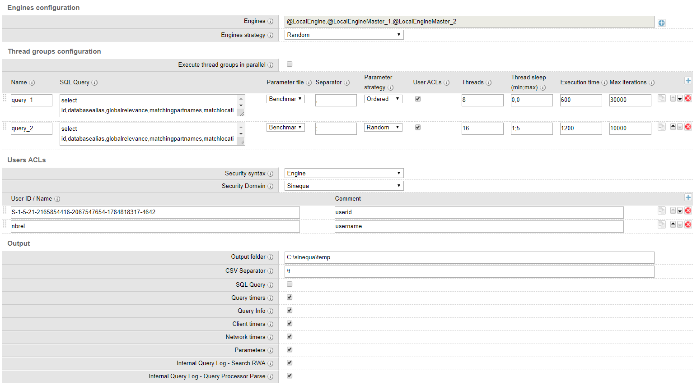

# EngineBenchmark

EngineBenchmak command aims to measure engine(s) performances at query time. Using this command, you can run repeatable and quantifiable scenarios to analyze what are the performances of the engine(s) through a set of metrics.

**This command allows you to measure engine(s) performances only**. This does not reflect what the user experience will be because some metrics are excluded such as: WebApp, network and browser rendering time.

In order to get accurate metrics, you need to **create realistic scenarios**. Your scenarios must closely reflect how the platform is or will be used. For example, even though the application will be accessible to thousands of users, only a small portion of them will use it in parallel  and only few will perform searches at the same time. So do not try to simulate thousands of concurrent queries if your Sinequa Grid has not been designed for it or if it's not the case. As a rule of thumb, it's **highly recommended to leverage the audit log** to get a sense of the activity on the platform and try to derive scenarios from it (using audit logs).

## Where should I execute the command ?

It is **recommended to execute this command on a different node than your Engine(s)**. The reason is, the command will use resources (CPU / memory) and this may affect Engine performances. If possible, you must run this command on a different Node, if not, make sure the command will have a minimum impact on performances (by reducing the number of threads for instance).

## Settings

### Engines

Field | Type | Default value | Required | Comment
--- | --- | --- | --- | --- 
Engines | List |  | yes | An Engine or a list of Engines, used to get the Engine Client to perform queries in the thread groups. If you select multiple Engines, the Engine used to perform the query will be dictated by the "Engine strategy" parameter.
Engines strategy | List | First Available | yes | First available: first available Engine from the list. If you select this option, all the queries will be executed on the same Engine. An engine is considered as "available" if his status is alive.  Random: load balance the queries between the Engines from the list.

**Recommendation**: Reproduce the "search strategy" defined in your "profile" or "Web Service - Search query". See below the mapping between the search strategy and how to configure the command:
* Strategy: "Normal", "Only EngineName", "Default engine of available"
    * Engines: Same engine as default or selected
    * Engines strategy: First Available
* Strategy: "Preferred ordered search engines of available"
    * Engines: Same engines as defined in the "search strategy", order matter
    * Engines strategy: First Available
* Strategy: "Preferred random search engines of available"
    * Engines: Same engines as defined in the "search strategy", order does not matter
    * Engines strategy: First Available
* Strategy: "Symmetric load balancing"
    * Engines: Same engines as defined in the "search strategy"
    * Engines strategy: Random

### Thread Group

Field | Type | Default value | Required | Comment
--- | --- | --- | --- | --- 
Execute thread groups in parallel | Boolean | False |  | Thread groups will be executed in parallel.   **Note**: If checked, the number of threads executed in parallel will be the sum of "threads" defined in the "thread groups" grid.
Name | String |  | yes | Thread group name, used in logs and output file.
SQL Query | String |  | yes | Support only select statement. You can use variables in this field with the following syntax $myvar$ where myvar is the variable name. These variables will be replaced by values from the "parameter file".  **Example**: select * from myindex where text contains '$fulltext$' and SearchParameters='mac=$mac$,pss=$pss$' skip 0 count 20   **Note**: If your SQL statement use indexes located on different Engines (brokering), you must reference the indexes as follow: indexname@engine1name&#124;engine2name&#124;...&#124;engineNname
Parameter file | List |  | yes | Custom file containing the variables names in the header (first line). Each subsequent line will represent a set of values.   **Example**:   fulltext;mac;pss   sinequa;10000;1000000   enterprise search;5000;2000000   **Note**: The variable name must not include $ signs and lines must have the same number of values as defined in the header.   **Note**: Please consider using "using cache 0" after you where clause to disable cache, especially if you have few lines in your parameter file. Otherwise queries will be cached by the Engine leading to biased results.
Separator | Char | ; | yes | Separator used in "Parameter file"
Parameter strategy | List |  | yes | Strategy to read values from "Parameter file". Values are pulled by line, the strategy define what line values is used to replace the variables in the SQL.   Ordered: threads will read lines from top to bottom.   Random: read in random order   **Note**: If you use more than 1 thread, with "Ordered" strategy, output order will look different because threads are running in parallel.
User ACLs | Boolean | false |  | If checked, add user ACLs in the SQL query. Will use the same strategy as defined for "Parameter strategy" (Ordered or Random). Please refer to the "Users ACLs" section for more information.   **Note** If used, make sure you SQL query contains a where clause without ACLs.
Threads | Integer | 5 | yes | Number of parallel threads, each thread will execute a SQL query.
Thread sleep | String | 3;10 | yes | Define min and max boundaries in seconds before a thread execute SQL query. Values are in seconds. Syntax: min;max.   **NOTE**: Min & Max values are in seconds   **NOTE**: Sleep instruction happens after thread start but before SQL execution   **NOTE**: For no sleep duration, use 0;0
Execution time | Integer | 60 | yes | Maximum execution time in seconds. Once execution time is reached, stop all threads execution.
Max iterations | Integer |100 | yes | Maximum number of iteration (SQL queries executed). Once max iterations is reached, stop all threads execution.

**Recommendation**: 

As a rule of thumb, make sure the Engine(s) is/are warmed before you execute you benchmark. If needed, run the benchmark a first time to warm the Engine(s). Make sure you run you benchmark for long enough (either number of iterations or max duration) to get a good amount of metrics to analyze. For instance, performing a run that will long for 30 minutes with at least 10K queries performed is a good practice.

SQL Query: Use the SQL query generated by your "profile" or "web service - search query" as an input for the SQL query. If you have "Tabs" you can also simulate the tab query by adding a second thread group with the tab query. In that case, you should probably use the "Execute thread groups in parallel" option.

Parameter file: In order to get a realistic simulation, a good practice is to use "audit" usages. Especially if you have a "text contains" clause, you can populate your parameter file with the top N fulltext search from the "audit" index. Don't hesitate to create multiple "parameter file" for different scenarios/thread group.

User ACLs: Consider using this option rather than adding users ACLs into your parameter file.

Threads	& Thread sleep: Use realistic values for these two parameters, try to estimate what is the real number of concurrent users on the system at peak time and define a sleep range that represent time in between two searches. No one is performing a query every two seconds, users must look at the results, open documents before searching again.

**NOTE**: By default, thread groups are executed sequentially, if you check "Execute thread groups in parallel" all thread groups will be executed in parallel. Consider this setting if you want to simulate both Tabs and Search query.

How to make sure I will run the same scenario multiple times?

To do that, use the "Ordered" option for "Parameter strategy" and make sure you'll always execute the same number of queries. So the trigger to stop the execution must be "Max iterations" and not "Execution time".

### Users ACLs

Field | Type | Default value | Required | Comment
--- | --- | --- | --- | --- 
Security Syntax | List | Engine | yes | Legacy: Full security clause (identities and groups) are sent as part of the SQL query.   Engine: only user identity is sent as part of the SQL query. Please note, Engine security requires version >= 11.3.0
Security Domain | List | | yes | Security domain used to get users id or user name
User ID / Name | String | | yes | You can use both a user ID or a user name
Comment | String | | no | Comment

Adding users in "Users ACLs" will automatically add one of the user security clause in the where clause. Users ACLs will be added only if you check "user ACLs" to the given thread group.

**Recommendation**: It is highly recommended to use this feature. If you don't provide any security clause in the SQL will be equivalent to perform a query on all the documents from your indexes. Querying all the document will most likely degrade search performances and by extension provide biased results. Try to add users from different business units because this will give more accurate results: users will more likely have access to different datasources and different documents from these datasources.

**NOTE**: Partitions are loaded once when the command start, based on the size and number of patitions this can take a few minutes.

**NOTE**: You need to have the "where" keyword in your SQL statment, otherwise the security clause will not be added.

### Output

Field | Type | Default value | Required | Comment
--- | --- | --- | --- | --- 
Output folder | String | | yes | Folder to store output file. The output file will contains [thread group name][iteration][date start][date end][success][engine name] and any other information based on what you selected below. File name will be "commandName_time.csv"   [Thread group name] => "thread group name" configured in "thread group"   [date start] => thread start date, format: yyyy-MM-dd HH:mm:ss.fff   [date end] => thread end date, format: yyyy-MM-dd HH:mm:ss.fff   [iteration] => integer representing execution order   [success] => boolean, false if query failed   [engine name] => Engine used to execute query 
CSV Separator | Char | \t | yes | Seperator used within the output CSV file
SQL Query | Boolean | false | | Add the following infomation in the output file: [sql].    [sql] => SQL query in chich variables are replaced with values from "parameter file"   **NOTE**: This can make the output file very big especially if you have a long query or lot of ACLs for users. It will also increase the memory footprint of the command: SQL queries will be keept in memory until the end of execution.
Query timers | Boolean | true | | Add the following infomation in the output file: [totalQueryTime][processingTime][rowfetchtime][readCursor]   [totalQueryTime] => represent toal query time: get client from pool, execute query, network and client to pool  [processingTime] => processing time attribute from query result   [rowfetchtime] => rowfetch time attribute from query result   [readCursor] => iterate on rows until reach the end of cursor
Query Info | Boolean | true | | Add the following infomation in the output file: [cachehit][matchingrowcount]   [matchingrowcount] => matching row count attribute from query result   [cachehit] => cachehit attribute from query result. If true, query result was cache in the Engine
Client timers | Boolean | true | | Add the following infomation in the output file: [clientFromPool][clientToPool]   [clientFromPool] => time to get a client from engine client pool   [clientToPool] => time to return client to engine pool
Network timers | Boolean | true | | Add the following infomation in the output file: [queryNetwork]   [queryNetwork] => estimated network time: a timer 'T' start before query execution, stop after reading data from cursor. Then network time = T - processingTime
Parameters | Boolean | true | | Add values from parameter file used to replace variables in the SQL query. If your thread group use User ACLs", the user full name will be displayed.
Internal Query Log - Search RWA | Boolean | false | | Add [Search RWA] duration per index. Represent the time to execute the search on the index, include DB Query time + full text search time.
Internal Query Log - DB Query | Boolean | false | | Add [Execute DBQuery] and [Fetching DBQuery] durations per index.   [Execute DBQuery] => time to evaluate conditions on structured columns   [Fetching DBQuery] => time to build the document set that validate conditions on structured columns 
Internal Query Log - Query Processor Parse | Boolean | false | | [SQL Parsing] duration of the SQL query

## Logs

After all thread groups have been executed, query will log statistics per thread group. See example below:

Thread Group [query_1]

Execution time [37 s 56.000 ms] 
Number of iterations [1000] 
Number of success queries [1000] 
Number of failed queries [0]

Average processing time [275.372 ms] 
Max processing time [2 s 939.620 ms] 
Average network time [43.071 ms] 
Average row fetch time [230.842 ms] 
Average engine client from pool time [0.190 ms] 
Average engine client to pool time [1.800 ms]

25th percentile processing time [42.650 ms] 
50th percentile processing time [93.340 ms] 
75th percentile processing time [142.530 ms] 
80th percentile processing time [336.570 ms] 
85th percentile processing time [446.230 ms] 
90th percentile processing time [559.280 ms] 
95th percentile processing time [2 s 50.610 ms]

QPS (Query Per Second) [26.986]

