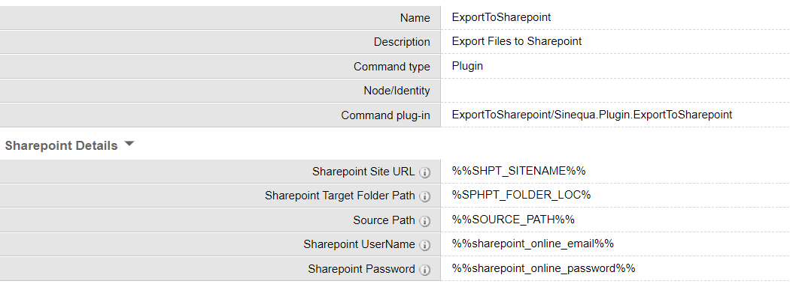

# ExportToSharepoint

ExportToSharepoint command helps to export large files (>300 MB) to sharepoint. There are multiple instances which require automated export of files to sharepoint.
Example, files generated from ExportIndexToCSV command can be exported to Sharepoint automatically.

This command can be scheduled as a job to export files at regular intervals to sharepoint.

## Pre-requisites

- Before using the command , make sure sinequa servers have access to the respective sharepoint site.
  If the sharepoint site cannot be accessed from the sinequa servers, the command will not work.
- Make sure you use a service account email dedicated for sinequa servers.

This command uses two sharepoint CSOM libraries to connect to sharepoint. Make sure these DLL files are added in website/bin folder.

- Microsoft.SharePoint.Client.dll
- Microsoft.SharePoint.Client.Runtime.dll

## Settings

### Sharepoint Settings

| Field                         | Type   | Comments                                                               |
| ----------------------------- | ------ | ---------------------------------------------------------------------- |
| Sharepoint Site URL           | String | Name of the sharepoint site                                            |
| Sharepoint Target Folder Path | String | Name of the documents folder within the sharepoint site, relative path |
| Source Path                   | String | Name of the documents folder within the sharepoint site, relative path |
| Sharepoint UserName           | String | Sharepoint user email                                                  |
| Sharepoint Password           | String | Sharepoint user password                                               |

## Install

Deploy the form override, command and the plugin file in your config:

- form-overrides/command.ExportToSharepoint.xml
- plugins/ExportToSharepoint/ExportToSharepoint.cs
- plugins/ExportToSharepoint/plugin.xml
- commands/ExportToSharepoint.xml

## NOTE:

The command already has some environment variables added in the command configuration. Make sure to add the environment variables to your sinequa instance to point to your organization's sharepoint.
