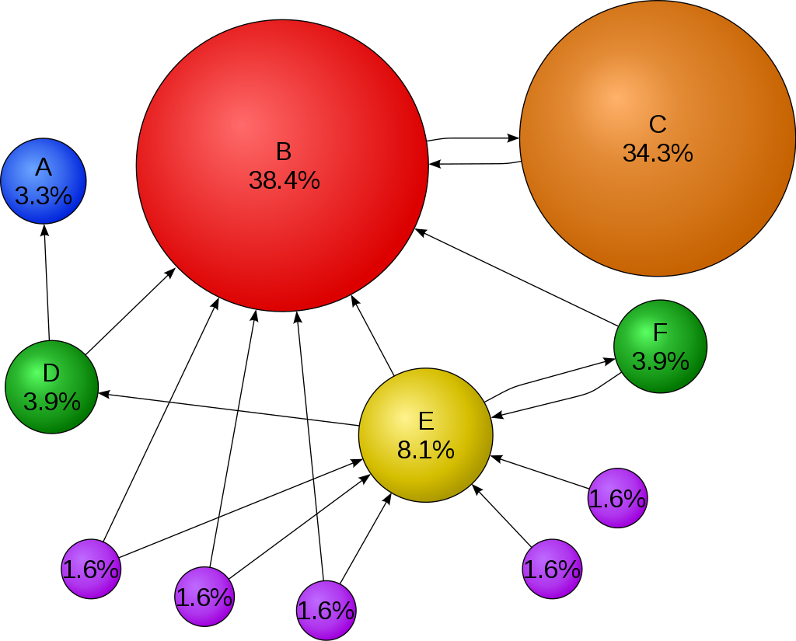
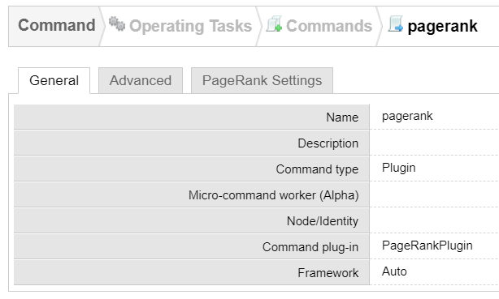
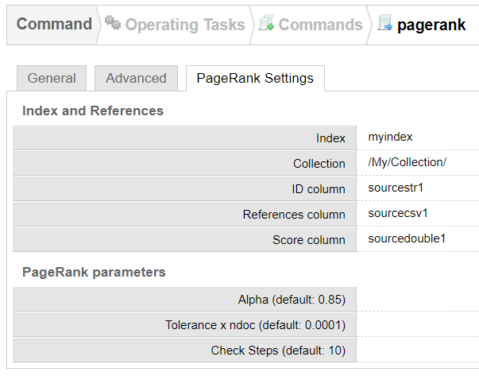
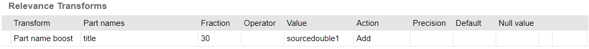

# PageRank

PageRank is an algorithm that aims to compute the importance of documents relative to each other within a corpus, independently from any user query.

This plugin packages an open-source implementation of PageRank and allows to apply the algorithm on a Sinequa index, in order to improve the relevance of search results.

PageRank generally leverages the hyperlinks in a document referencing other documents. In a nutshell, the more (*important*) documents reference a document, the more important that document must be.


(Illustration from [Wikipedia](https://fr.wikipedia.org/wiki/PageRank#/media/Fichier:PageRanks-Example.svg))

PageRank doesn't only work on Hyperlinks. It can be generalized to other types of document identifier and references:

- The path of a document in a file system.
- A document ID from a nomenclature (eg. "Secret Report N°6732762387").
- Citations from research papers (for example [research papers](https://pubmed.ncbi.nlm.nih.gov/26288312/))
- A list of emails and their sender/recipient also form a graph that can be used to evaluate the influence of people in an organization.

Computing a measure of the intrinsic **importance** of a document is critical to offer good search relevance.

Indeed, for a given query, you may have many search results that are practically equivalent from a TD/IDF point of view, but have a very different (and obvious) levels of importance in the eye of the user. When searching for "Barack Obama", Google returns first the Wikipedia Page of Barack Obama, rather than posts from a small forum, although they might have similar statistical relevance. The difference is that Wikipedia is referenced by many other sources, and has therefore a much higher PageRank, which pops it at the top of the results.

## How it works

The PageRank is computed **after** the indexing, as a post-processing. In order to run the PageRank command, it is necessary to populate two columns:

- An **ID** column: An identifier of the document (which is referenced by other documents). This can be for example the URL of the document (`url1` column). Currently the plugin only supports single-value columns (although a document might have IDs of different natures).
- A **link** column (typically a CSV): A semicolon-separated list of IDs of other documents. For example, a list of URLs.

The plugin updates the documents in the index with a **score** stored in a numerical column. By default the score is a number between 0 and 0.5 (with the idea of being easily combined with the global relevance which is between 0 and 1).

The score can then be added to your relevance calculation via a **relevance transform**.

## Extracting IDs and links from documents

The ID of a document can be many things. In the context of a PageRank calculation, what matters is that this ID is used to reference the document from other documents.

The ID of the document is typically extracted from the native document metadata (URL, path, title, reference number, etc.). In this case, using mappings in your collection configuration is generally enough.

Sometimes the links to other document IDs are also available in the document metadata. In which case the mapping configuration can also be used to extract them. However, it is more common that the links are only available in the HTML or the text of the documents.

If the links are available in the HTML (for example, the `href` attribute of hyperlinks), then a plugin can extract these in the following way:

```C#
// Connector Plugin entry point
public override Return ApplyMappings(SinequaDoc sdoc, ConnectorDoc doc)
{
    XPathNavigator xml = doc.GetXPathDocument().CreateNavigator();
    XPathNodeIterator links = xml.Select("//div[contains(@class, 'content')]//a/@href");
    string linklist = ExtractLinks(links);
    sdoc.SourceCsvSet(2, linklist);
}

// A Regular expression to detect anchors in URLs
private Regex anchor = new Regex("#.*$");

// Return the list of links as a semicolon-separated list
private string ExtractLinks(XPathNodeIterator links)
{
    HashSet<string> set = new HashSet<string>();
    StringBuilder sb = new StringBuilder();

    foreach (XPathNavigator link in links)
    {
        string linkstr = link.ToString();
        linkstr = anchor.Replace(linkstr, ""); // Remove the #anchor from the URL
        if(!set.Contains(linkstr))
        {
            set.Add(linkstr);
            if (sb.Length > 0)
                sb.Append(";");
            sb.Append(key);
        }
    }

    return sb.ToString();
}
```

If the links to other document IDs are instead in the text of the document, then Sinequa offers a palette of NLP tool to extract these links. For example, to extract a formatted document reference number, a regex-based entity would be a good choice.

For example, a Regex entity with the pattern `RP\d{10}` could easily extract the reference in the following sentence:

> *We have used the study **RP0032378712** to complete these calculations...*

For more complex patterns and normalization, a Text-Mining Agent would be necessary.

## Command configuration

The command is accompanied by a form-override. When you copy the plugin and form-override into your configuration, compile the plugin and create a new command.

Select "Plugin" for the command type, and "PageRankPlugin" for the Command plug-in. Save the configuration and now switch to the "PageRank Settings" tab:



In the "PageRank Settings", configure:

- The name of your index.
- The name of your collection.
- The name of the column where you store the document ID (for PageRank - this is most likely different from the document id in the Sinequa index).
- The name of the multivalued column where you store the links.
- The name of the numerical column where you want to store the PageRank score.



Additional optional parameters are available:

- Alpha: a value between 0 and 1. Determines the relative importance of "stochastic" links.
- Tolerance: A relative tolerance to reach after which the algorithm is considered converged.
- Check steps: check for convergence after so many steps.

After the command has run (which can take a while), check the logs to verify the convergence was obtained.

You can also check that the **score** column was properly populated. Note that if you order by decreasing scores, you should find the most "important" (in a PageRank sense) document of the corpus come first.

```sql
SELECT title, sourcedouble1 FROM index ORDER BY sourcedouble1 DESC LIMIT 10;
```

## Modifying the search relevance

By default the plugin computes a score between 0 and 0.5, in order to be easily combined with the global relevance (which ranges from 0 to 1).

However, this normalization is entirely arbitrary, and there are many other ways of normalizing (or not) the PageRank score. The current formula is as follows (from the `UpdateRelevance()` method):

```C#
double value = 0.5 * Math.Sqrt((values[idx] - min) / (max - min));
```

Where `min` and `max` are the minimum and maximum values of the PageRank computed over the corpus (this guarantees that at least one document has a 0 score, and one document has a 0.5 score, and every other is in between).

The use of a square root is purely empirical. It intends to correct the strong penalty experienced by low-pagerank documents. Alternatively a logarithm function could be used.

Now the score needs to be combined with the global relevance, which again can be done in many different ways.

A naive and easy approach is to just add the **score** to the **globalrelevance**. This means the PageRank could account for roughly one third of the relevance (probably less in practice as the average score is much below 0.5).

One problem with this approach is that you run the risk that a poorly relevant document is too much boosted by its PageRank. A solution is to apply the boost only when the relevance is already above a threshold.

This type of implementation can be achieved via a [scripted relevant transform](https://doc.sinequa.com/en.sinequa-es.v11/Content/syntax/relevanceTransforms/en.script.html).

Alternatively, the following is a configuration-based relevance transformation, which applies the PageRank additively, when 30% of the search terms are found in the document title.



## Scalability

The PageRank algorithmic complexity is roughly proportional to the number of links in the corpus. This implementation of the algorithm does not scale beyond a few of millions of documents. In particular there are two limitations:

- This implementation makes use of dense arrays (as opposed to sparse arrays). The cost of memory is thus unnecessarily large.
- This implementation is not parallel nor distributed, although is naturally good candidate for massively distributed platforms, such as Spark.

In practice this plugin has been tested on corpuses of a few million documents a can take up to a few hours to converge.

## License

Creative Commons Attribution 2.5 License

The implementation on the PageRank algorithm in this plugin was taken and adapted from: https://github.com/jeffersonhwang/pagerank where it is released under a Creative Commons Attribution 2.5 License.

The original Python code was released by Vincent Kraeutler under a Creative Commons Attribution 2.5 License.
