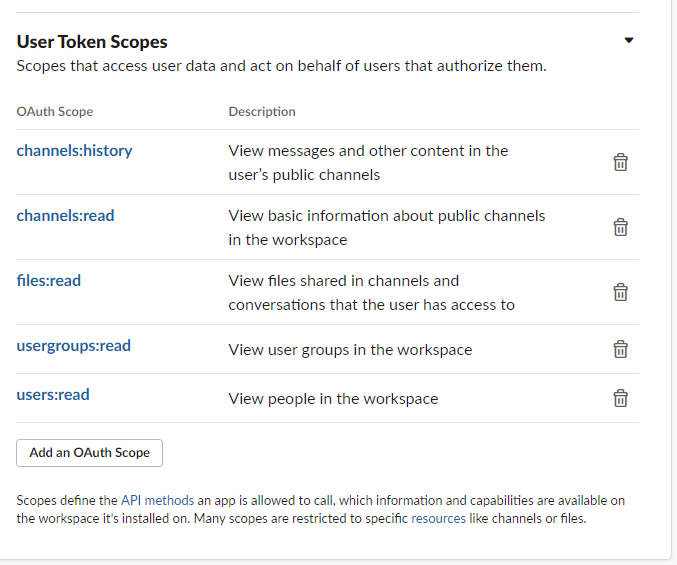
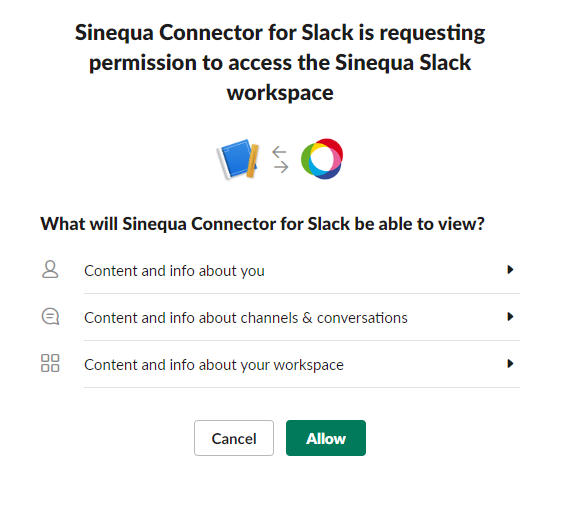
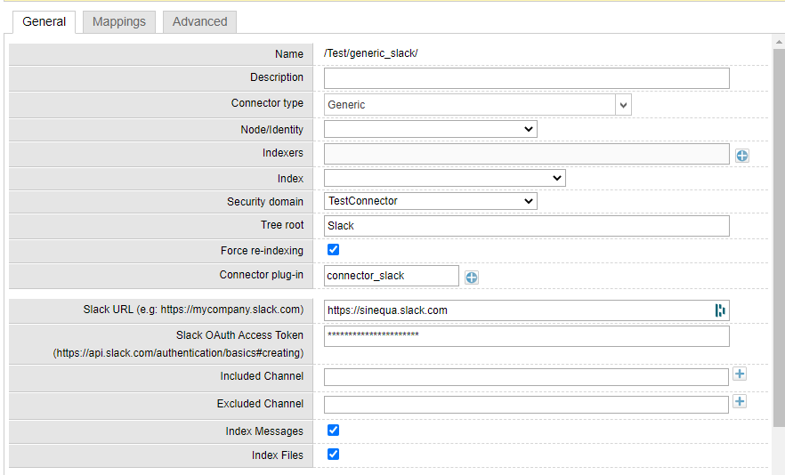
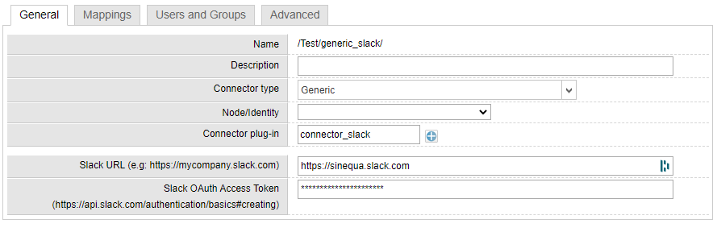

# SlackConnector

SlackConnector is a plug-in for illustrating how to develop a **generic** connector which consumes a REST API.

This plug-in index the **Slack** application.

Plug-in capabilites:
- Sinequa:
  - Collection Mode
  - Partition Mode
  - Form-override for customizing the administration form
- Slack:
  - Filtering on Channels
  - Index Messages
  - Index Files
  - Supports rights (ACL)
  - Supports realtime mode

**NOTE**: This connector doesn't index private messages (only public/private channels)

## Pre-requisites

In order to use the REST API of Slack, you need to create an App (https://api.slack.com/apps) with these **User Token Scopes**:
- `channels:history`
- `channels:read`
- `files:read`
- `usergroups:read`
- `users:read`

Then `install the App to Workspace` 

and retreives the `OAuth Access Token`

## Install
Deploy the form override and the plugin file in your config:
- form-overrides/collection.connector_slack.xml
- form-overrides/partition.connector_slack.xml
- plugins/SlackConnector/connector_slack.cs

- Create a collection with the `generic` connector type and  the `connector_slack` plug-in.

- Create a partition with the `generic` connector type and the `connector_slack` plug-in.

## Some Links
- https://api.slack.com/authentication/basics
- https://api.slack.com/web
- https://api.slack.com/methods
- https://doc.sinequa.com/en.sinequa-es.v11/Content/en.sinequa-es.devDoc.plugin.connector.getting-started.html#ConnectorPluginWorkflow
